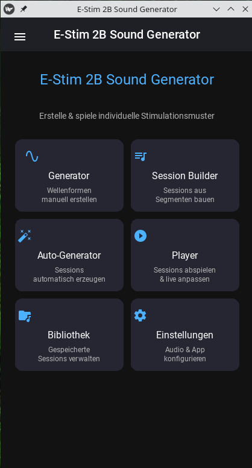

# E-Stim 2B Sound Generator

Plattformübergreifende Anwendung (Linux & Android) zur Erzeugung individueller Audio-Stimulationsmuster für das **E-Stim 2B** Elektrostimulationsgerät.

<p align="center">
  
</p>

## Features

- **Signal Generator** — Manuelle Wellenform-Erstellung mit Echtzeit-Vorschau
  - 8 Wellenformen: Sinus, Rechteck, Dreieck, Sägezahn, Puls, Rauschen, Chirp, Burst
  - Unabhängige Steuerung beider Kanäle (A = Links, B = Rechts)
  - Modulation: AM, FM, PWM, Tremolo, Rampe, Welle

- **Session Builder** — Erstelle Sequenzen aus Mustern/Segmenten
  - Timeline-basierter Editor
  - Preset-Muster als Ausgangspunkt
  - Übergänge: Überblendung, Ein-/Ausblendung, Sofort

- **Auto-Generator** — Automatische Session-Erstellung
  - 6 Stile: Entspannung, Rhythmisch, Intensiv, Neckisch, Meditation, Abenteuer
  - 8 Intensitätskurven: Linear, Dreieck, Welle, Plateau, Zufällig, Eskalation, etc.
  - Konfigurierbare Dauer, Intensität und Zufälligkeit

- **Player** — Echtzeit-Wiedergabe mit Live-Kontrollen
  - Frequenz, Amplitude, Wellenform während der Wiedergabe ändern
  - Master-Lautstärke und Balance
  - Wellenform-Visualisierung

- **Bibliothek** — Verwaltung gespeicherter Sessions
  - Laden, Abspielen, Bearbeiten, Löschen

## Audio-Protokoll

Das E-Stim 2B akzeptiert Stereo-Audio-Eingang:
- **Linker Kanal** → E-Stim Kanal A
- **Rechter Kanal** → E-Stim Kanal B
- **Amplitude** steuert die Stimulationsintensität
- **Frequenzbereich**: ~2 Hz bis ~300 Hz

## Installation

### Linux

```bash
# Abhängigkeiten installieren
pip install -r requirements.txt

# App starten
python main.py
```

### Android (APK bauen)

```bash
# Buildozer installieren
pip install buildozer

# APK erstellen
buildozer android debug
```

## Abhängigkeiten

- Python 3.9+
- Kivy >= 2.2.0
- KivyMD >= 1.1.1
- NumPy >= 1.24.0
- sounddevice >= 0.4.6
- SciPy >= 1.10.0

## Projektstruktur

```
sound_generator/
├── main.py                         # App-Einstiegspunkt
├── requirements.txt                # Python-Abhängigkeiten
├── buildozer.spec                  # Android Build-Konfiguration
├── core/                           # Audio-Engine (plattformunabhängig)
│   ├── waveforms.py                # Wellenform-Generatoren
│   ├── modulation.py               # Modulationseffekte
│   ├── patterns.py                 # Muster-Definitionen & Presets
│   ├── session.py                  # Session-Verwaltung
│   ├── session_generator.py        # Auto-Session-Generator
│   ├── audio_engine.py             # Echtzeit-Audio-Engine
│   └── export.py                   # WAV-Export
├── ui/                             # Benutzeroberfläche
│   ├── app.kv                      # Kivy Design-Datei
│   ├── screens/                    # App-Bildschirme
│   │   ├── home_screen.py
│   │   ├── generator_screen.py
│   │   ├── session_builder_screen.py
│   │   ├── auto_generator_screen.py
│   │   ├── player_screen.py
│   │   ├── library_screen.py
│   │   └── settings_screen.py
│   └── widgets/                    # Wiederverwendbare Widgets
│       ├── waveform_display.py
│       └── channel_mixer.py
├── presets/                        # Eingebaute Muster
│   └── default_patterns.json
└── sessions/                       # Gespeicherte Sessions
```

## Sicherheitshinweise

⚠ **WICHTIG**: Beginne **IMMER** mit niedriger Intensität am E-Stim 2B Gerät!

- Erhöhe die Stärke langsam und schrittweise
- Teste neue Muster zuerst bei minimaler Lautstärke
- Benutze die Sanfter-Start-Funktion (Fade-In)
- Beende die Stimulation sofort bei Unbehagen
